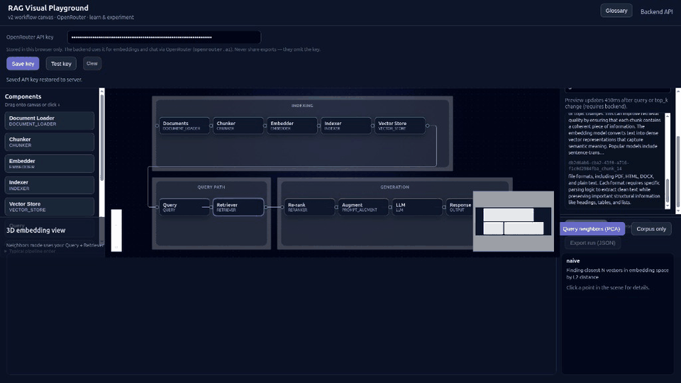

# RAG Playground

Interactive RAG (Retrieval-Augmented Generation) playground to **learn**, **visualize**, and **experiment** with every step of a modern RAG pipeline using OpenRouter-based models.


## Demo



> Put your recording at `assets/demo.gif` (repo root) to render this preview on GitHub.

## Purpose

This project is built to make RAG systems understandable and testable:

- See what each node does (loader, chunker, embedder, retriever, prompt augment, LLM).
- Run individual nodes or full pipelines and inspect outputs.
- Tune settings (`top_k`, chunk size, model IDs, temperature) and observe impact.
- Explore semantic neighborhoods through projection visualizations.
- Export run artifacts without leaking credentials.

If you are learning RAG, this tool helps you bridge the gap between architecture diagrams and real execution.

## Skill level

- **Beginner**: Understand the RAG flow and inspect intermediate outputs.
- **Intermediate**: Tune retrieval and prompting strategies, compare behavior.
- **Advanced**: Extend node types, add evaluators, and benchmark model/index choices.

## Core tags / topics

`RAG` `OpenRouter` `FastAPI` `React` `XYFlow` `FAISS` `Embeddings` `Prompt Engineering` `Visualization` `PCA` `UMAP` `LLM Ops`

## What you can do

- Bring your own OpenRouter key from UI settings.
- Upload `.txt` and `.pdf` documents.
- Preview chunking before spending embedding tokens.
- Build and inspect vector index health.
- Query and view retrieved chunks with scores and metadata.
- Assemble prompts with `{query}` + `{context}` templates.
- Generate answers through OpenRouter models.
- Visualize embedding neighborhoods (3D when WebGL is available, 2D fallback when not).
- Export execution runs as JSON (API key redacted).

## Architecture

- **Backend** (`backend/`)
  - FastAPI APIs
  - Document ingestion and chunking
  - OpenRouter embedding + generation
  - FAISS indexing and retrieval
  - Pipeline and query orchestration
- **Frontend v2** (`frontend_v2.0/`)
  - React + Vite
  - XYFlow node-canvas editor
  - Inspector panels + per-node run actions
  - Projection visualization and run export

## OpenRouter setup

1. Create an API key at [OpenRouter](https://openrouter.ai/).
2. Open the app and paste key in **Settings**.
3. Click **Save key** (stored in browser + synced to backend session).
4. Click **Test key** to validate.
5. Pick model IDs in node configs (defaults are aligned with OpenRouter IDs).

### Important notes

- **Cost**: Embedding and chat requests are billable.
- **Dimension matching**: Embedding model output dimension must match `embedding_dim` (e.g. 1536 for `openai/text-embedding-3-small`).
- **Security**: Export files redact API keys. Still use caution on shared machines.

## Quick start (local dev)

### 1) Backend

```bash
cd backend
python -m venv venv
source venv/bin/activate   # Windows: venv\Scripts\activate
pip install -r requirements.txt
uvicorn main:app --reload --host 0.0.0.0 --port 8000
```

Backend docs: `http://localhost:8000/docs`

### 2) Frontend

```bash
cd frontend_v2.0
npm install
npm run dev
```

Frontend (default): `http://localhost:5173`

## Docker Compose

Run everything together:

```bash
docker compose up --build
```

If your Docker uses legacy compose:

```bash
docker-compose up --build
```

Services:

- Frontend: `http://localhost:5173`
- Backend API: `http://localhost:8000`
- API docs: `http://localhost:8000/docs`

Data persistence:

- Backend storage is persisted using volume `rag_backend_storage`.

## How to use (first run)

1. Save and test OpenRouter key in **Settings**.
2. Add a document in **Document Loader**.
3. Configure **Chunker** and verify preview.
4. Configure **Embedder** (model + dim) and build index.
5. Enter a question in **Query**.
6. Click **Run pipeline**.
7. Inspect per-node outputs and retrieval details.
8. Open projection view (`Query neighbors` / `Corpus only`).
9. Export run JSON if needed.

## API highlights

| Method | Endpoint | Use |
|--------|----------|-----|
| POST | `/api/pipeline/credentials` | Set API key without index rebuild |
| POST | `/api/pipeline/verify-key` | Validate OpenRouter key |
| POST | `/api/pipeline/configure` | Apply full config (may trigger rebuild path) |
| POST | `/api/pipeline/build-index` | Build/rebuild index |
| POST | `/api/pipeline/execute-graph` | Run visual DAG |
| POST | `/api/pipeline/execute-node` | Run one node in isolation |
| POST | `/api/pipeline/preview-retrieval` | Fast retrieval preview |
| POST | `/api/query` | End-to-end query (`visualization_only` supported) |
| GET | `/api/pipeline/embedding-space` | Corpus projection (PCA/UMAP) |

## Project structure

```text
RAG Playground/
├── backend/
├── frontend_v2.0/
├── docker-compose.yaml
├── plan.md
└── README.md
```

## Roadmap

See [`plan.md`](plan.md) for phased checklist and implementation status.

## License

MIT
